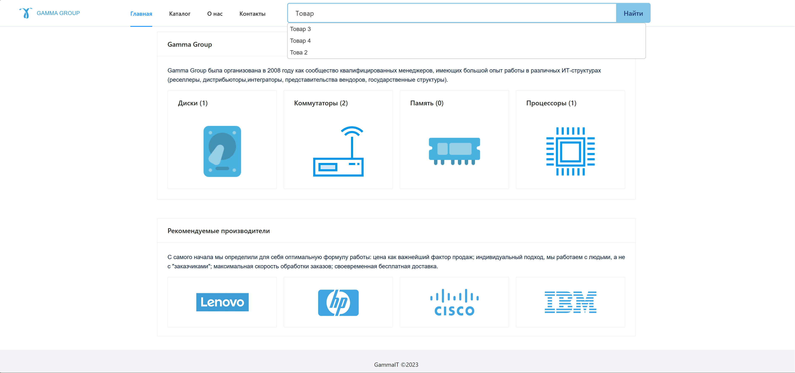
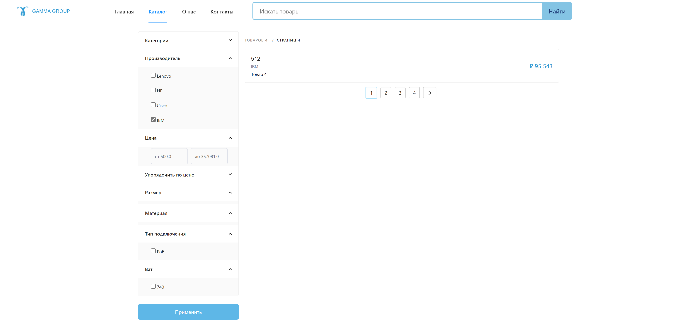

# New catalog of server components
**Data Driven Implementation**

# DB Scheme


# Component Diagram


# Result



# Dependencies
- Django v.4.*
- DRF v.3.*
- elasticsearch v.7
- celery
- redis
- haystack
- postgresql v.15*
- sqlite3

# Run app
- pip install virtualenv
- virtualenv -p python3 venv
- venv\Scripts\activate.bat OR venv\Scripts\Activate.ps1
- pip install -r requirements.txt
- python manage.py makemigrations
- python manage.py migrate
- [optional] python mange.py createsuperuser (default: admin:admin)
- python manage.py search_index --rebuild (elasticsearch)
- python manage.py rebuild_index (haystack)
- python manage.py runserver

# Catalog filter class
```python
class ProductFilter(django_filters.FilterSet):
    price = django_filters.RangeFilter(
        field_name='price',
    )
    order_by_price = django_filters.ChoiceFilter(
        method='filter_by_price',
        label='Упорядочить по цене',
        choices=(
            ('ascending', 'По возврастанию'),
            ('descending', 'По убыванию')
        ),
        widget=forms.RadioSelect()
    )
    name = django_filters.CharFilter(
        widget=forms.HiddenInput(),
        field_name='name',
        lookup_expr='icontains'
    )
    description = django_filters.CharFilter(
        widget=forms.HiddenInput(),
        field_name='description'
    )
    part_number = django_filters.CharFilter(
        widget=forms.HiddenInput(),
        field_name='part_number'
    )

    @staticmethod
    def filter_by_price(queryset, name, value):
        if value == 'ascending':
            return queryset.order_by('price')
        elif value == 'descending':
            return queryset.order_by('-price')
        else:
            return queryset

    def filter_queryset(self, queryset):
        qs = update_rates(super().filter_queryset(queryset))

        if len(qs) != 0:
            min_price = min(qs, key=lambda p: p.price).price
            max_price = max(qs, key=lambda p: p.price).price
        else:
            min_price = 0
            max_price = 0

        # добавлять в поля фильтра по цене минимальную и максимальную цены товаров в выборке
        self.form.fields['price'].widget.widgets[0].attrs['placeholder'] = f"от {min_price}"
        self.form.fields['price'].widget.widgets[1].attrs['placeholder'] = f"до {max_price}"

        return qs

    def __init__(self, *args, **kwargs):
        try:
            category = args[0].get('category', None)
        except IndexError:
            category = None
        try:
            brand = args[0].get('brand', None)
        except IndexError:
            brand = None

        super(ProductFilter, self).__init__(*args, **kwargs)

        if category:
            details_pks = Specs.objects.filter(product__category__slug=category).values_list('detail__pk')
            brands_pks = Products.objects.filter(category__slug=category).values_list('brand__slug')

            details = Details.objects.filter(pk__in=details_pks)
            brands = Brands.objects.filter(slug__in=brands_pks)
        else:
            details = Details.objects.all()
            brands = Brands.objects.all()

        if brand:
            categories_pks = Products.objects.filter(brand__slug=brand).values_list('category__slug')
            categories = Categories.objects.filter(slug__in=categories_pks)
        else:
            categories = Categories.objects.all()

        # Выводи только те категории, которые присущи товарам выбранного бренда
        self.filters['category'] = django_filters.ModelMultipleChoiceFilter(
            field_name='category',
            label='Категории',
            queryset=categories,
            to_field_name='slug',
            widget=forms.CheckboxSelectMultiple(attrs={'class': 'checkbox-list'}),
        )

        # Выводим только те бренды, которые присущи выбранной категории
        self.filters['brand'] = django_filters.ModelMultipleChoiceFilter(
            field_name='brand',
            label='Производитель',
            queryset=brands,
            to_field_name='slug',
            widget=forms.CheckboxSelectMultiple(attrs={'class': 'checkbox-list'}),
        )

        # Выводим только те характеристики и их свойства, которые присущи товарарам в выбранной категории
        for detail in details:
            specs = Specs.objects.filter(detail=detail)
            self.filters[detail.name] = django_filters.ModelMultipleChoiceFilter(
                field_name='specs__pk',
                queryset=specs,
                to_field_name='pk',
                widget=forms.CheckboxSelectMultiple(attrs={'class': 'checkbox-list'}),
            )

    class Meta:
        model = Products
        exclude = ('currency', )
```