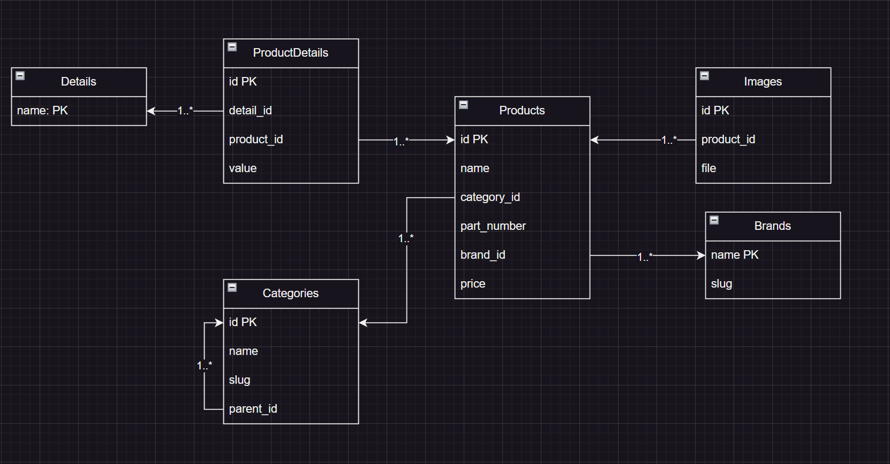
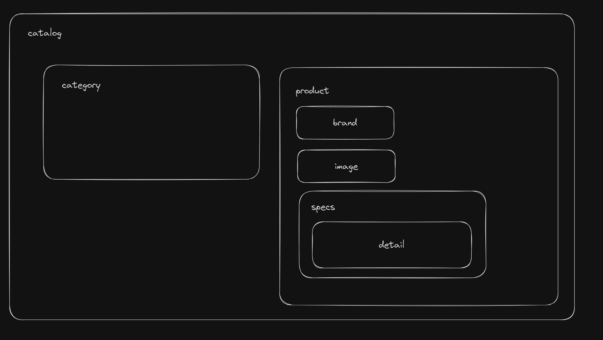

# New catalog of server components
**Data Driven Implementation**

# DB Scheme


```python
# Categories slug creating
def save(self, *args, **kwargs):
    slug_path = [self.slug]

    current_parent = self.parent
    while current_parent:
        slug_path.insert(0, current_parent.slug)
        current_parent = current_parent.parent

    self.slug = '-'.join(slug_path)

    super(Categories, self).save(*args, **kwargs)
```
```python
"""Category tree-representation"""
from functools import cache
from typing import List
from dataclasses import asdict
from dataclasses import dataclass


@dataclass
class Category:
    name: str
    slug: str
    children: list['Category']

class CategoryRepository:
    @staticmethod
    def serialize(categories: list[Category] | Category) -> list[dict]:
        if type(categories) == list:
            return [asdict(cat) for cat in categories]
        else:
            return asdict(categories)

    @cache
    def tree(self) -> list[Category]:
        base_categories = Categories.objects.filter(parent__isnull=True)
        return [
            Category(
                name=cat.name,
                slug=cat.slug,
                children=self.get_children(cat)
            )
            for cat in base_categories
        ]

    @cache
    def get_children(self, category: Categories) -> List[Category]:
        children = Categories.objects.filter(parent=category)

        return [
            Category(
                name=child.name,
                slug=child.slug,
                children=self.get_children(child)
            )
            for child in children
        ]

"""
[
    {
        "name": "Категория 1",
        "slug": "cat-1",
        "children": [
            {
                "name": "Категория 2",
                "slug": "cat-1-cat-2",
                "children": [
                    {
                        "name": "Категория 3",
                        "slug": "cat-1-cat-1-cat-2-cat-3",
                        "children": []
                    }
                ]
            },
            {
                "name": "Категория 4",
                "slug": "cat-1-cat-4",
                "children": []
            }
        ]
    }
]
"""
```
```python
"""elastisearch document for Products searching"""
@registry.register_document
class ProductDocument(Document):
    class Index:
        name = 'product'
        settings = {
            'number_of_shards': 1,
            'number_of_replicas': 0
        }

    brand = fields.ObjectField(properties={
        'name': fields.TextField(),
    })

    category = fields.ObjectField(properties={
        'name': fields.TextField()
    })

    specs = fields.ObjectField(properties={
        'detail': fields.ObjectField(properties={
            'name': fields.TextField()
        }),
        'value': fields.TextField()
    })

    part_number = fields.KeywordField()
    name = fields.TextField()

    class Django:
        model = Products

        related_models = [Brands, Categories]

    def get_queryset(self):
        return super(ProductDocument, self).get_queryset().select_related('brand', 'category').prefetch_related(
            Prefetch(
                'specs',
                Specs.objects.all().select_related('detail')
            )
        )

    @staticmethod
    def get_instances_from_related(related_instance):
        if isinstance(related_instance, Brands):
            return related_instance.products_by_brand.all()
        elif isinstance(related_instance, Categories):
            return related_instance.products_by_category.all()
```
```python
"""haystack index for Products searching"""
class ProductIndex(indexes.SearchIndex, indexes.Indexable):
    text = indexes.CharField(document=True, use_template=True, template_name='search/indexes/product_text.txt')
    name = indexes.CharField(model_attr='name')
    part_number = indexes.CharField(model_attr='part_number')
    brand = indexes.CharField(model_attr='brand__name')
    category = indexes.CharField(model_attr='category__name')
    specs = indexes.MultiValueField()

    def get_model(self):
        return Products

    def prepare_specs(self, obj):
        return [spec.value for spec in obj.specs.all()]

    def index_queryset(self, using=None):
        """Used when the entire index for model is updated."""
        return self.get_model().objects.all().select_related('brand', 'category').prefetch_related('specs', 'images')

"""txt doc
{{ object.name }}
{{ object.brand.name }}
{{ object.part_number }}
{{ object.category.name }}

    {{ value }}

"""

```

# Component Diagram


# Dependencies
- Django v.4.*
- DRF v.3.*
- elasticsearch v.7

# Run app
- pip install virtualenv
- virtualenv -p python3 venv
- venv\Scripts\activate.bat OR venv\Scripts\Activate.ps1
- pip install -r requirements.txt
- python manage.py makemigrations
- python manage.py migrate
- [optional] python mange.py createsuperuser (default: admin:admin)
- python manage.py search_index --rebuild (elasticsearch)
- python manage.py rebuild_index (haystack)
- python manage.py runserver